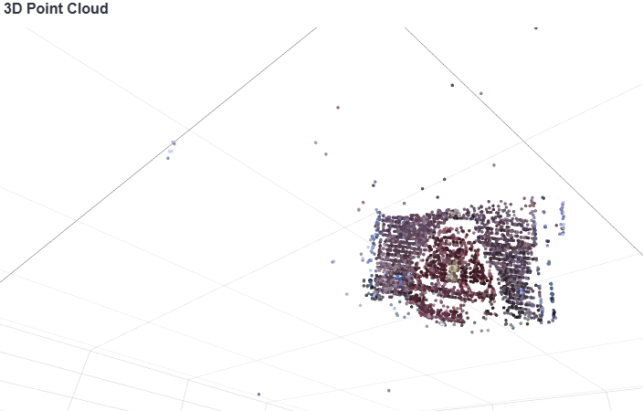
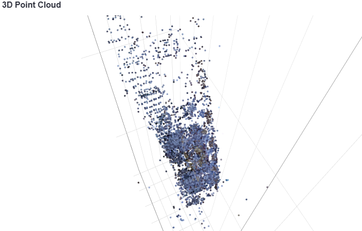
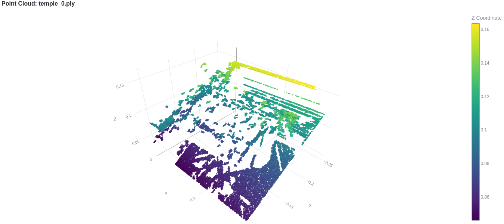

# 3D Reconstruction from 2D Images

This project implements a comprehensive 3D reconstruction pipeline using multiple computer vision techniques. Starting from a collection of 2D images, the system generates 3D representations of scenes or objects using two complementary approaches: Structure from Motion (SfM) and Multi-View Stereo (MVS).

## Overview

3D reconstruction from multiple views is a fundamental computer vision task with applications in archaeology, architecture, gaming, AR/VR, robotics, and more. This repository contains implementations of:

1. **Structure from Motion (SfM)**: Generates sparse point clouds and camera poses from unstructured image collections
2. **Multi-View Stereo (MVS)**: Creates dense, detailed reconstructions from calibrated image sequences

## Live Demos

- **SfM Web Application**: [https://3d-recon-from-2d.streamlit.app/](https://3d-recon-from-2d.streamlit.app/)
- **MVS Web Application**: [https://reconstruction-3d-from-2d.streamlit.app/](https://reconstruction-3d-from-2d.streamlit.app/)

## Demo Video

- [Watch the Demo Video](https://drive.google.com/file/d/1yMa6iec-Ve-20Zy3aGoD8frb7txvY2je/view?usp=sharing)

## Required Packages

### For Structure from Motion (SfM)
```bash
pip install opencv-contrib-python>=4.8.0 numpy matplotlib plyfile
```

### For Multi-View Stereo (MVS)
```bash
pip install numpy opencv-contrib-python>=4.6.0 matplotlib pillow open3d>=0.15.0 scipy pathlib
```

### For Web Application
```bash
pip install streamlit pathlib plyfile plotly
```

## Datasets

### Built-in SfM Datasets
The code has been tested with these benchmark datasets:
- **fountain-P11**: Small scene with a fountain structure (11 images)
- **entry-P10**: Building entrance with varied illumination (10 images)
- **Herz-Jesus-P8/P25**: Chapel with fine architectural details (8/25 images)
- **castle-P19**: Large-scale outdoor scene with complex geometry (19 images)

### MVS Dataset
- **Temple Ring**: 12 calibrated images of a temple figurine in a circular arrangement

## Structure from Motion (SfM) Pipeline

SfM reconstructs sparse 3D point clouds through:
1. Feature extraction and matching
2. Camera pose estimation
3. Triangulation of 3D points

### Running SfM

#### Step 1: Extract Features
```bash
python SFM/script/featmatch.py --data_dir path/to/images/ --out_dir output_dir/ --features SIFT --matcher BFMatcher
```

#### Step 2: Run Structure from Motion
```bash
python SFM/script/sfm.py --data_dir data_dir/ --dataset dataset_name --features SIFT --matcher BFMatcher --out_dir results_dir/ --plot_error True
```

### Key Parameters
- `--features`: Feature detector (SIFT, SURF, ORB)
- `--matcher`: Feature matcher (BFMatcher, FlannBasedMatcher)
- `--calibration_mat`: Camera calibration matrix type (benchmark, lg_g3)
- `--plot_error`: Generate reprojection error visualizations

## Multi-View Stereo (MVS) Pipeline

MVS creates dense reconstructions through:
1. Image rectification
2. Stereo matching for disparity maps
3. Triangulation to generate 3D points
4. Point cloud alignment and merging

### Running MVS

#### Step 1: Process Image Pairs
```bash
python MVS/Temple.py
```

#### Step 2: Merge and Align Point Clouds
```bash
python MVS/temple_icp_merger.py --input_dir Data/Output --output_dir Data/Output/Merged
```

### Key Parameters for MVS
- `topologies`: Camera pairing configuration ('360', 'overlapping', 'adjacent', 'skipping_1', 'skipping_2')
- `--voxel_size`: Downsampling for point clouds
- `--create_mesh`: Enable mesh generation

## Web Application

The repository includes a Streamlit web application that provides a user-friendly interface for:
- Running SfM on built-in datasets
- Uploading custom images with user-provided intrinsics
- 3D visualization of reconstructed point clouds
- Downloading results in PLY format

To run the web app locally:

```bash
streamlit run app.py
```

## Project Structure
```
3D-Reconstruction-from-2D-Images/
├── SFM/                  # Structure from Motion implementation
│   ├── script/           # Python scripts for SFM
│   │   ├── featmatch.py  # Feature extraction and matching
│   │   ├── sfm.py        # SFM pipeline
│   │   └── utils.py      # Utility functions
│   ├── data/             # Input datasets
│   └── results/          # Reconstruction results
├── MVS/                  # Multi-View Stereo implementation
│   ├── Temple.py         # Main MVS script
│   ├── temple_icp_merger.py # Point cloud merging
│   └── load_*.py         # Utility scripts
├── app.py                # Streamlit web application
└── assets/               # Sample outputs and images
```

## Sample Reconstructions

Here are some examples of reconstructions from the pipeline:

### Structure from Motion (SfM) Results

*Fountain-P11 dataset reconstruction*


*entry-P10 dataset reconstruction*

### Multi-View Stereo (MVS) Results

*Temple Ring dataset dense reconstruction*

## Contributing

Contributions to improve the project are welcome. Please feel free to submit a Pull Request.

## License

This project is open-source and available under the MIT License.